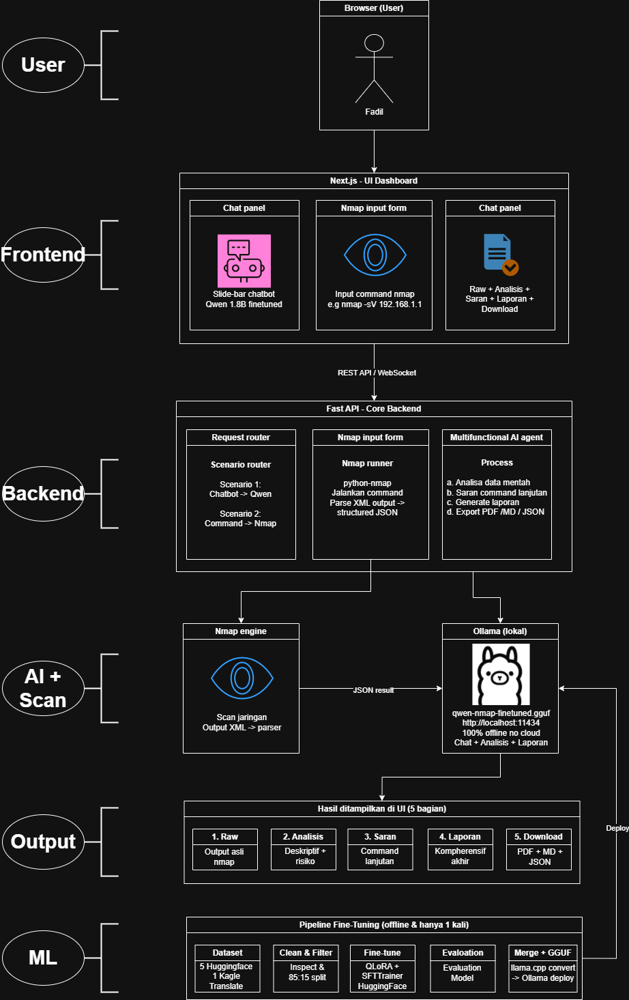

# NmapSLM

A local desktop-web app that hooks Nmap into a hybrid AI analysis stack powered by Ollama, Gemini, and a fine-tuned Qwen model for network security.

---

## Architecture

```
Browser (User)
    ↓  HTTP / WebSocket
Next.js 15 Dashboard
├── Chat Panel (AI Assistant)
├── Nmap Input Form
└── Result Dashboard (5 tab)
    ↓  REST API / WebSocket
FastAPI Core Backend
├── Request Router
├── Nmap Runner (python-nmap + XML parser)
├── Default Gemini and for Fallback Ollama AI Agent
└── Report Generator (PDF/MD/JSON)
    ↓
Nmap Engine → XML → Parser → JSON
    +
Gemini/Ollama
    ↓
Output: Raw | Analysis | Suggestions | Report | Download
```

---

## Prerequisites

| Tools        | Version     | Instalation                         |
|--------------|-------------|-------------------------------------|
| Python       | 3.11+       | `sudo apt install python3.11`       |
| Node.js      | 18+         | `nvm install 20`                    |
| Nmap         | 7.x+        | `sudo apt install nmap`             |
| Ollama       | latest      | https://ollama.ai/download          |

---

## Getting Started

### 1. Clone the Repo & Jump In

```bash
git clone https://github.com/zerocool979/0cool.git
cd nmap-slm
chmod +x start.sh
```

### 2. Setup Agent

In default case we just put in the Gemini API Key on env, so...
```bash
# Copy env template
cp backend/.env.example backend/.env
# Write ur key
GEMINI_API_KEY=AIza.....
```
## All About Gemini

**GeminiCLI.py** ​​is primarily used to check the response of the model being used, but it can also be used for more positive purposes.

## Step by step:

Make sure you have obtained your API key from **(https://aistudio.google.com/app/apikey)**

Export the Gemini API variable

- **Windows**
```bash
$env:GOOGLE_API_KEY = "your_google_api_key"
```
- **Mac/Linux**
```bash
export GOOGLE_API_KEY="your_google_api_key"
```

Check the available Models for the Gemini API

```bash
python3 ListModelGemini.py
```

Set the Model and prompt to your liking and see the results after running it.

```bash
python3 GeminiCLI.py
```

> _"Note: Get your API key from (https://aistudio.google.com/app/apikey)"_


and in the another case, we also can Pull an Ollama Model

```bash
# Lightweight model (1.5B parameters, ~1GB) Or go with a stronger model (7B parameters, ~4.5GB)
ollama pull qwen2.5:1.5b / ollama pull qwen2.5:7b

# Make sure Ollama is up and running
ollama serve
```

### 3. Fire Up the App

```bash
# Launch everything (backend + frontend)
./start.sh

# Or run services separately
./start.sh --backend-only
./start.sh --frontend-only
```

### 4. Open Ur Browser

```
Dashboard : http://localhost:3000
API Docs  : http://localhost:8000/docs
```

---

## Manual Config

### Backend

```bash
cd backend
python -m venv .venv
source .venv/bin/activate      # Windows: .venv\Scripts\activate
pip install -r requirements.txt

# Run it
uvicorn app.main:app --reload --port 8000
```

### Frontend

```bash
cd frontend
npm install
npm run dev  # port 3000
```

---

## Architecture&Workflow

<p align="center">
  
</p>

---

## Author

**zerocool979**
GitHub: [@zerocool979](https://github.com/zerocool979)

**Noctarey**
GitHub: [@Noctarey](https://github.com/Noctarey)

**lukmanNR**
GitHub: [@lukmanNR](https://github.com/lukmanNR)

**fadl1004**
GitHub: [@fadl1004](https://github.com/fadl1004)
